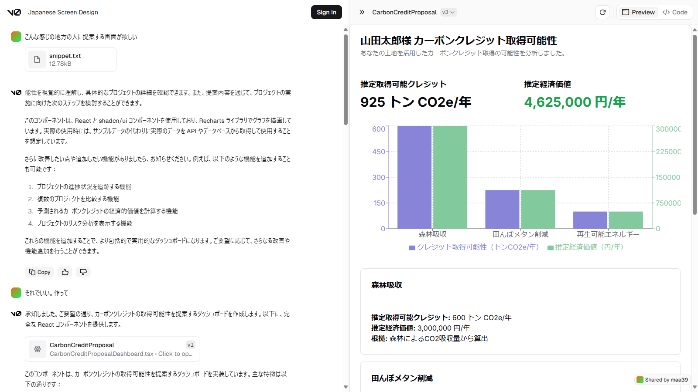

# Co2TA
A tool leveraging LLMs to facilitate the acquisition of carbon credits.
炭素クレジットの取得を促進するために LLM を活用するツール。

# 概要
ITに長けた都市部住人がふるさと納税のように「カーボンテックアシスト」を使って地方の生産者をDXで支援します。都市部住人がオープンデータを使って応援したい地方都市で有効なJクレジット獲得プランを作成して登録します。登録されたプランを基礎自治体職員やJA、漁協などが見て興味のありそうな生産者とマッチングをして、実際にJクレジット申請を行います。認定されたJクレジットの売り上げは生産者に還元され、生産者は特産品などをカーボンテックアシストをしてくれた都市部住人に返礼品として贈ります。これにより、地方の生産者はDXを進めるほど儲かることがわかります。

# 進め方
ツールの開発とビジネスの開発の二つに分かれます。

## ツール開発
全体設計は以下のUMLを参照してください。

### Frontend
UXはChatGPTのGPTsに近しい画面となります。

### ODB
LLMとの接続は以下のOpenData Bridgeを使用します。
内部的にOpen Interpreterを使用し、LLMがデータ処理を担うPythonコードを生成することが特徴です。

https://github.com/dx-junkyard/opendata-bridge-frontend

### Backend (含むLocal Dev PC)
J-クレジット申請書は以下の認定済み申請書をデータベースとして利用します。

https://japancredit.go.jp/project/

J-クレジットはあらかじめ承認された方法論でしか申請を受けることをしません。そこで、以下の方法論ごとに内部的にテンプレートを持つことを想定しています。Backendは定期的に方法論や認定済み申請書を更新して最新の情報を取り込みます。

https://japancredit.go.jp/about/methodology/

データ解析と検索エンジンにはLlama-indexを使用します。
Neural EngineとしてnVidia以外にAMDやFPGAを使うことも想定しており、OpenCLやVulkanでの動作実績があるLlama-indexを使用します。

## ビジネス開発
